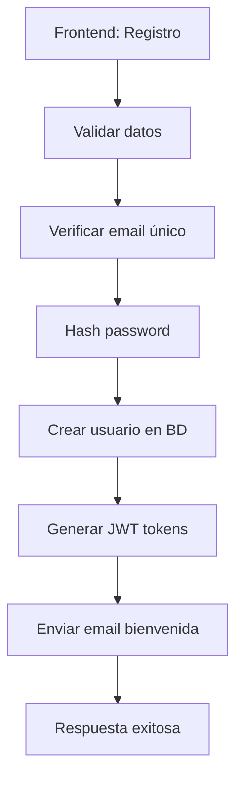
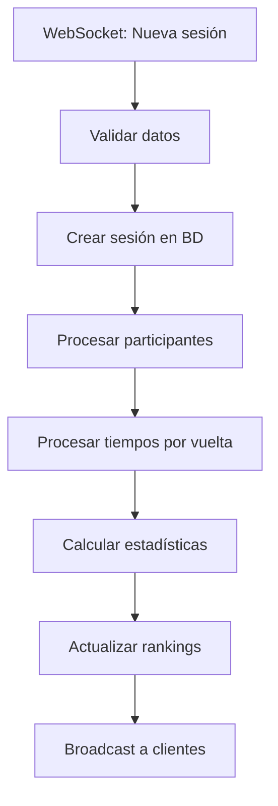
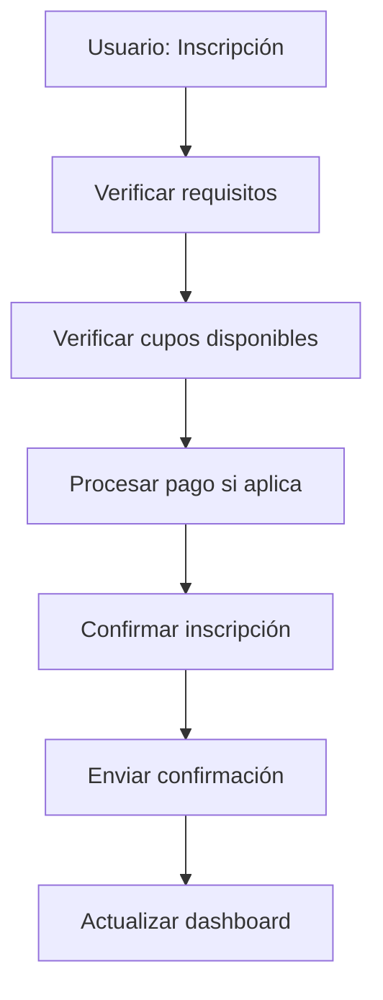

# 🚀 SPEEDPARK KARTING WEBAPP - BACKEND ARCHITECTURE

## 📋 Resumen Ejecutivo

Backend Node.js + Express con arquitectura modular, diseñado para manejar timing en tiempo real, gestión de usuarios, carreras organizadas y sistema de liga. Integración nativa con SMS-Timing API y WebSocket para datos live.

---

## 🏗️ ARQUITECTURA GENERAL

```
┌─────────────────┐    ┌─────────────────┐    ┌─────────────────┐
│   FRONTEND      │    │   BACKEND API   │    │   INTEGRATIONS  │
│                 │    │                 │    │                 │
│ React/Next.js   │◄──►│ Node.js/Express │◄──►│ SMS-Timing API  │
│ Socket.io       │    │ Socket.io       │    │ WebSocket       │
│                 │    │ MongoDB         │    │ Email Service   │
└─────────────────┘    └─────────────────┘    └─────────────────┘
                              │
                              ▼
                    ┌─────────────────┐
                    │   DATABASE      │
                    │                 │
                    │   MongoDB       │
                    │   Redis Cache   │
                    └─────────────────┘
```

---

## 📁 ESTRUCTURA DEL PROYECTO

```
speedpark-backend/
├── src/
│   ├── config/          # Configuraciones
│   │   ├── database.js
│   │   ├── redis.js
│   │   ├── sms-timing.js
│   │   └── server.js
│   │
│   ├── models/          # Modelos de MongoDB (Mongoose)
│   │   ├── User.js
│   │   ├── Session.js
│   │   ├── SessionParticipant.js
│   │   ├── LapTime.js
│   │   ├── Race.js
│   │   ├── Season.js
│   │   ├── GlobalStats.js
│   │   └── LiveSession.js
│   │
│   ├── controllers/     # Controladores de rutas
│   │   ├── auth.controller.js
│   │   ├── users.controller.js
│   │   ├── sessions.controller.js
│   │   ├── races.controller.js
│   │   ├── seasons.controller.js
│   │   ├── stats.controller.js
│   │   └── live.controller.js
│   │
│   ├── routes/          # Definición de rutas
│   │   ├── index.js
│   │   ├── auth.routes.js
│   │   ├── users.routes.js
│   │   ├── sessions.routes.js
│   │   ├── races.routes.js
│   │   ├── seasons.routes.js
│   │   ├── stats.routes.js
│   │   └── live.routes.js
│   │
│   ├── services/        # Lógica de negocio
│   │   ├── auth.service.js
│   │   ├── users.service.js
│   │   ├── sessions.service.js
│   │   ├── races.service.js
│   │   ├── seasons.service.js
│   │   ├── stats.service.js
│   │   ├── sms-timing.service.js
│   │   ├── websocket.service.js
│   │   ├── email.service.js
│   │   └── cache.service.js
│   │
│   ├── middleware/      # Middlewares
│   │   ├── auth.middleware.js
│   │   ├── validation.middleware.js
│   │   ├── rate-limit.middleware.js
│   │   ├── cors.middleware.js
│   │   └── error.middleware.js
│   │
│   ├── utils/           # Utilidades
│   │   ├── logger.js
│   │   ├── helpers.js
│   │   ├── constants.js
│   │   ├── validators.js
│   │   └── formatters.js
│   │
│   ├── jobs/            # Tareas programadas
│   │   ├── stats-calculator.job.js
│   │   ├── session-processor.job.js
│   │   ├── ranking-updater.job.js
│   │   └── data-sync.job.js
│   │
│   ├── websocket/       # WebSocket handlers
│   │   ├── index.js
│   │   ├── live-timing.handler.js
│   │   ├── race-events.handler.js
│   │   └── notifications.handler.js
│   │
│   └── tests/           # Tests
│       ├── unit/
│       ├── integration/
│       └── e2e/
│
├── migrations/          # Migraciones de datos
├── scripts/            # Scripts de utilidad
├── docs/               # Documentación
├── .env.example
├── package.json
├── docker-compose.yml
└── README.md
```

---

## 🛠️ STACK TECNOLÓGICO

### **Core Technologies**
- **Node.js 18+** - Runtime principal
- **Express.js** - Framework web
- **MongoDB** - Base de datos principal
- **Mongoose** - ODM para MongoDB
- **Redis** - Cache y sesiones
- **Socket.io** - WebSocket para tiempo real

### **Authentication & Security**
- **JWT** - Autenticación stateless
- **bcrypt** - Hash de passwords
- **helmet** - Security headers
- **cors** - Cross-origin requests
- **rate-limiter-flexible** - Rate limiting

### **External Integrations**
- **axios** - HTTP client para SMS-Timing API
- **ws** - WebSocket client para SMS-Timing
- **nodemailer** - Email notifications
- **node-cron** - Scheduled jobs

### **Development & Monitoring**
- **Winston** - Logging
- **Morgan** - HTTP request logging  
- **Jest** - Testing framework
- **Supertest** - API testing
- **Swagger** - API documentation
- **PM2** - Process management

---

## 🔗 API ENDPOINTS PRINCIPALES

### **Authentication**
```javascript
POST   /api/auth/register          // Registro de usuario
POST   /api/auth/login             // Login
POST   /api/auth/logout            // Logout
POST   /api/auth/refresh           // Refresh token
POST   /api/auth/forgot-password   // Recuperar password
POST   /api/auth/reset-password    // Reset password
```

### **Users Management**
```javascript
GET    /api/users/profile          // Perfil del usuario actual
PUT    /api/users/profile          // Actualizar perfil
GET    /api/users/:id              // Perfil público de usuario
GET    /api/users/:id/stats        // Estadísticas de usuario
GET    /api/users/:id/sessions     // Historial de sesiones
GET    /api/users/leaderboard      // Top corredores
POST   /api/users/link-sms-timing  // Vincular cuenta SMS-Timing
```

### **Sessions & Timing**
```javascript
GET    /api/sessions               // Lista de sesiones
GET    /api/sessions/:id          // Detalle de sesión
GET    /api/sessions/:id/results  // Resultados de sesión
GET    /api/sessions/:id/laps     // Tiempos por vuelta
GET    /api/sessions/recent       // Sesiones recientes
GET    /api/sessions/live         // Sesión en vivo actual
```

### **Races Management**
```javascript
GET    /api/races                 // Lista de carreras
POST   /api/races                 // Crear carrera (admin)
GET    /api/races/:id             // Detalle de carrera
PUT    /api/races/:id             // Actualizar carrera (admin)
POST   /api/races/:id/register    // Inscribirse a carrera
DELETE /api/races/:id/register    // Cancelar inscripción
GET    /api/races/:id/participants // Participantes inscritos
POST   /api/races/:id/results     // Subir resultados (admin)
```

### **Seasons & League**
```javascript
GET    /api/seasons               // Lista de temporadas
GET    /api/seasons/current       // Temporada actual
GET    /api/seasons/:id           // Detalle de temporada
GET    /api/seasons/:id/ranking   // Ranking de temporada
GET    /api/seasons/:id/races     // Carreras de temporada
GET    /api/seasons/:id/stats     // Estadísticas de temporada
```

### **Statistics & Analytics**
```javascript
GET    /api/stats/global          // Estadísticas globales
GET    /api/stats/records         // Récords de pista
GET    /api/stats/monthly         // Estadísticas mensuales
GET    /api/stats/trends          // Tendencias y análisis
GET    /api/stats/comparisons     // Comparativas entre usuarios
```

### **Live Timing**
```javascript
GET    /api/live/session          // Sesión activa actual
GET    /api/live/leaderboard      // Clasificación en vivo
WebSocket /live                   // Conexión tiempo real
```

---

## 🧩 SERVICIOS PRINCIPALES

### **1. Authentication Service**
```javascript
// src/services/auth.service.js
class AuthService {
  async register(userData, smsPersonId = null)
  async login(email, password)
  async refreshToken(refreshToken)
  async forgotPassword(email)
  async resetPassword(token, newPassword)
  async linkSMSTiming(userId, personId)
}
```

### **2. Users Service**
```javascript
// src/services/users.service.js
class UsersService {
  async getUserProfile(userId)
  async updateProfile(userId, updateData)
  async getUserStats(userId)
  async getUserSessions(userId, options = {})
  async getLeaderboard(type = 'bestTime', limit = 10)
  async calculateUserStats(userId)
  async mergeGuestData(userId, guestSessions)
}
```

### **3. Sessions Service**
```javascript
// src/services/sessions.service.js
class SessionsService {
  async getAllSessions(filters = {})
  async getSessionById(sessionId)
  async getSessionResults(sessionId)
  async getSessionLaps(sessionId)
  async processNewSession(smsSessionData)
  async calculateSessionStats(sessionId)
  async syncWithSMSTiming()
}
```

### **4. SMS-Timing Integration Service**
```javascript
// src/services/sms-timing.service.js
class SMSTimingService {
  async fetchSessionData(smsSessionId)
  async fetchLapTimes(smsSessionId)
  async fetchParticipants(smsSessionId)
  async syncHistoricalData()
  async validatePersonId(personId)
  
  // WebSocket integration
  startLiveDataStream()
  stopLiveDataStream()
  processLiveMessage(message)
}
```

### **5. Races Service**
```javascript
// src/services/races.service.js
class RacesService {
  async createRace(raceData, createdBy)
  async getAllRaces(filters = {})
  async getRaceById(raceId)
  async registerForRace(raceId, userId)
  async cancelRegistration(raceId, userId)
  async processRaceResults(raceId, smsSessionId)
  async calculateRacePoints(raceId)
  async sendRaceNotifications(raceId, type)
}
```

### **6. WebSocket Service**
```javascript
// src/services/websocket.service.js
class WebSocketService {
  constructor(io) { this.io = io }
  
  // SMS-Timing WebSocket connection
  connectToSMSTiming()
  handleSMSTimingMessage(message)
  
  // Client WebSocket handlers  
  handleClientConnection(socket)
  broadcastLiveUpdate(data)
  broadcastRaceEvent(event)
  sendPersonalNotification(userId, notification)
}
```

---

## 🔄 FLUJOS DE DATOS PRINCIPALES

### **1. Registro de Usuario**


### **2. Procesamiento de Sesión SMS-Timing**


### **3. Inscripción a Carrera**


---

## 📊 MODELOS DE DATOS (MONGOOSE)

### **User Model**
```javascript
// src/models/User.js
const userSchema = new mongoose.Schema({
  personId: {
    type: String,
    unique: true,
    sparse: true, // Permite nulls únicos
    index: true
  },
  alias: {
    type: String,
    required: true,
    index: true
  },
  email: {
    type: String,
    required: true,
    unique: true,
    lowercase: true
  },
  password: {
    type: String,
    required: true,
    select: false // No incluir en queries por default
  },
  
  // Información personal
  firstName: String,
  lastName: String,
  avatar: String,
  dateOfBirth: Date,
  
  // Estadísticas (calculadas y cacheadas)
  stats: {
    bestLapTime: { type: Number, index: true },
    bestLapSession: String,
    totalRaces: { type: Number, default: 0 },
    totalWins: { type: Number, default: 0 },
    totalPodiums: { type: Number, default: 0 },
    averagePosition: Number,
    cleanDriverScore: { type: Number, default: 100 },
    consistencyScore: Number,
    lastCalculated: { type: Date, default: Date.now }
  },
  
  // Liga
  league: {
    currentSeasonPoints: { type: Number, default: 0 },
    currentRank: Number,
    seasonId: { type: mongoose.Schema.Types.ObjectId, ref: 'Season' },
    totalSeasons: { type: Number, default: 0 }
  },
  
  // Configuración
  preferences: {
    notifications: { type: Boolean, default: true },
    publicProfile: { type: Boolean, default: true },
    units: { type: String, enum: ['metric', 'imperial'], default: 'metric' },
    language: { type: String, default: 'es' }
  },
  
  // Control de acceso
  role: { type: String, enum: ['user', 'admin', 'moderator'], default: 'user' },
  isActive: { type: Boolean, default: true },
  emailVerified: { type: Boolean, default: false },
  
  // Timestamps
  lastActive: Date,
  lastStatsUpdate: Date
}, {
  timestamps: true,
  toJSON: { virtuals: true },
  toObject: { virtuals: true }
});

// Índices compuestos
userSchema.index({ 'league.seasonId': 1, 'league.currentSeasonPoints': -1 });
userSchema.index({ 'stats.bestLapTime': 1, 'isActive': 1 });

// Virtuals
userSchema.virtual('fullName').get(function() {
  return `${this.firstName} ${this.lastName}`.trim();
});

// Middleware
userSchema.pre('save', async function(next) {
  if (this.isModified('password')) {
    this.password = await bcrypt.hash(this.password, 12);
  }
  next();
});

module.exports = mongoose.model('User', userSchema);
```

### **Session Model**
```javascript
// src/models/Session.js
const sessionSchema = new mongoose.Schema({
  smsSessionId: {
    type: String,
    required: true,
    unique: true,
    index: true
  },
  name: {
    type: String,
    required: true
  },
  date: {
    type: Date,
    required: true,
    index: true
  },
  
  // SMS-Timing data
  sessionState: {
    type: Number,
    enum: [1, 2, 3], // programada, activa, completada
    default: 3
  },
  resourceId: String,
  resourceKind: Number,
  
  // Resultados
  results: {
    winner: {
      userId: { type: mongoose.Schema.Types.ObjectId, ref: 'User' },
      alias: String,
      personId: String
    },
    bestTime: { type: Number, index: true },
    totalParticipants: Number,
    duration: Number,
    totalLaps: Number
  },
  
  // Clasificación
  type: {
    type: String,
    enum: ['practice', 'qualifying', 'race', 'official'],
    default: 'practice',
    index: true
  },
  category: {
    type: String,
    enum: ['open', 'junior', 'senior', 'pro', 'women'],
    default: 'open'
  },
  isOfficial: {
    type: Boolean,
    default: false,
    index: true
  },
  weatherConditions: {
    type: String,
    enum: ['dry', 'wet', 'mixed'],
    default: 'dry'
  },
  
  // Metadatos
  processedAt: Date,
  dataSource: {
    type: String,
    enum: ['websocket', 'api', 'manual'],
    default: 'api'
  }
}, {
  timestamps: true
});

// Índices compuestos
sessionSchema.index({ type: 1, isOfficial: 1, date: -1 });
sessionSchema.index({ 'results.bestTime': 1, date: -1 });

module.exports = mongoose.model('Session', sessionSchema);
```

---

## 🔐 MIDDLEWARES DE SEGURIDAD

### **Authentication Middleware**
```javascript
// src/middleware/auth.middleware.js
const jwt = require('jsonwebtoken');
const User = require('../models/User');

const authenticate = async (req, res, next) => {
  try {
    const token = req.header('Authorization')?.replace('Bearer ', '');
    
    if (!token) {
      return res.status(401).json({ error: 'Access denied. No token provided.' });
    }
    
    const decoded = jwt.verify(token, process.env.JWT_SECRET);
    const user = await User.findById(decoded.userId).select('-password');
    
    if (!user || !user.isActive) {
      return res.status(401).json({ error: 'Invalid token.' });
    }
    
    req.user = user;
    next();
  } catch (error) {
    res.status(401).json({ error: 'Invalid token.' });
  }
};

const authorize = (...roles) => {
  return (req, res, next) => {
    if (!roles.includes(req.user.role)) {
      return res.status(403).json({ error: 'Access denied. Insufficient permissions.' });
    }
    next();
  };
};

module.exports = { authenticate, authorize };
```

### **Rate Limiting**
```javascript
// src/middleware/rate-limit.middleware.js
const { RateLimiterRedis } = require('rate-limiter-flexible');
const redis = require('../config/redis');

const rateLimiter = new RateLimiterRedis({
  storeClient: redis,
  keyPrefix: 'rl_api',
  points: 100, // Number of requests
  duration: 60, // Per 60 seconds by IP
});

const rateLimitMiddleware = async (req, res, next) => {
  try {
    await rateLimiter.consume(req.ip);
    next();
  } catch (rejRes) {
    const secs = Math.round(rejRes.msBeforeNext / 1000) || 1;
    res.set('Retry-After', String(secs));
    res.status(429).json({
      error: 'Too many requests',
      retryAfter: secs
    });
  }
};

module.exports = rateLimitMiddleware;
```

---

## 🔄 WEBSOCKET HANDLERS

### **Live Timing Handler**
```javascript
// src/websocket/live-timing.handler.js
const LiveSession = require('../models/LiveSession');

class LiveTimingHandler {
  constructor(io) {
    this.io = io;
    this.smsWebSocket = null;
    this.currentSession = null;
  }
  
  // Conectar a SMS-Timing WebSocket
  connectToSMSTiming() {
    const WebSocket = require('ws');
    this.smsWebSocket = new WebSocket('wss://webserver22.sms-timing.com:10015/');
    
    this.smsWebSocket.on('open', () => {
      console.log('Connected to SMS-Timing WebSocket');
      this.smsWebSocket.send('START 8501@speedpark');
    });
    
    this.smsWebSocket.on('message', (data) => {
      this.handleSMSTimingMessage(data.toString());
    });
    
    this.smsWebSocket.on('error', (error) => {
      console.error('SMS-Timing WebSocket error:', error);
    });
  }
  
  // Procesar mensajes de SMS-Timing
  async handleSMSTimingMessage(message) {
    try {
      const data = JSON.parse(message);
      
      if (data.D && Array.isArray(data.D)) {
        // Datos de timing en vivo
        const liveData = this.processLiveTimingData(data);
        
        // Actualizar base de datos
        await this.updateLiveSession(liveData);
        
        // Broadcast a clientes conectados
        this.io.to('live-timing').emit('timing-update', liveData);
        
        // Detectar eventos especiales
        const events = this.detectRaceEvents(liveData);
        if (events.length > 0) {
          this.io.to('live-timing').emit('race-events', events);
        }
      }
    } catch (error) {
      console.error('Error processing SMS-Timing message:', error);
    }
  }
  
  // Procesar datos de timing en vivo
  processLiveTimingData(data) {
    const sessionInfo = {
      sessionName: data.N || 'Sesión Activa',
      timestamp: new Date().toISOString(),
      drivers: []
    };
    
    data.D.forEach(driver => {
      sessionInfo.drivers.push({
        name: driver.N,
        kart: driver.K,
        position: driver.P,
        currentLap: driver.L,
        lastLapTime: driver.T,
        bestTime: driver.B,
        gap: driver.G || 0,
        racerID: driver.D
      });
    });
    
    // Ordenar por posición
    sessionInfo.drivers.sort((a, b) => a.position - b.position);
    
    return sessionInfo;
  }
  
  // Detectar eventos especiales
  detectRaceEvents(currentData) {
    const events = [];
    
    // Comparar con datos anteriores para detectar cambios
    if (this.previousData) {
      // Nuevo mejor tiempo
      const currentBest = Math.min(...currentData.drivers.map(d => d.bestTime).filter(t => t > 0));
      const previousBest = Math.min(...this.previousData.drivers.map(d => d.bestTime).filter(t => t > 0));
      
      if (currentBest < previousBest) {
        const driver = currentData.drivers.find(d => d.bestTime === currentBest);
        events.push({
          type: 'best_lap',
          message: `¡${driver.name} establece nuevo mejor tiempo: ${(currentBest/1000).toFixed(3)}s!`,
          driver: driver.name,
          time: currentBest,
          timestamp: new Date()
        });
      }
      
      // Cambios de liderato
      const currentLeader = currentData.drivers.find(d => d.position === 1);
      const previousLeader = this.previousData.drivers.find(d => d.position === 1);
      
      if (currentLeader.name !== previousLeader.name) {
        events.push({
          type: 'leader_change',
          message: `¡${currentLeader.name} toma el liderato!`,
          driver: currentLeader.name,
          timestamp: new Date()
        });
      }
    }
    
    this.previousData = currentData;
    return events;
  }
  
  // Actualizar sesión en vivo en BD
  async updateLiveSession(liveData) {
    try {
      await LiveSession.findOneAndUpdate(
        { status: 'active' },
        {
          sessionName: liveData.sessionName,
          currentDrivers: liveData.drivers,
          lastUpdate: new Date(),
          status: 'active'
        },
        { upsert: true, new: true }
      );
    } catch (error) {
      console.error('Error updating live session:', error);
    }
  }
  
  // Manejar conexión de cliente
  handleClientConnection(socket) {
    console.log(`Client connected: ${socket.id}`);
    
    // Unirse a sala de timing en vivo
    socket.on('join-live-timing', async () => {
      socket.join('live-timing');
      
      // Enviar datos actuales
      const currentData = await LiveSession.findOne({ status: 'active' });
      if (currentData) {
        socket.emit('timing-update', {
          sessionName: currentData.sessionName,
          drivers: currentData.currentDrivers,
          timestamp: currentData.lastUpdate
        });
      }
    });
    
    // Salir de sala de timing en vivo
    socket.on('leave-live-timing', () => {
      socket.leave('live-timing');
    });
    
    socket.on('disconnect', () => {
      console.log(`Client disconnected: ${socket.id}`);
    });
  }
}

module.exports = LiveTimingHandler;
```

---

## 📅 JOBS Y TAREAS PROGRAMADAS

### **Stats Calculator Job**
```javascript
// src/jobs/stats-calculator.job.js
const cron = require('node-cron');
const User = require('../models/User');
const SessionParticipant = require('../models/SessionParticipant');

class StatsCalculatorJob {
  // Ejecutar cada hora
  static start() {
    cron.schedule('0 * * * *', async () => {
      console.log('Starting stats calculation job...');
      await this.calculateAllUserStats();
      await this.updateGlobalStats();
      console.log('Stats calculation job completed');
    });
  }
  
  static async calculateAllUserStats() {
    const users = await User.find({ isActive: true });
    
    for (const user of users) {
      await this.calculateUserStats(user._id);
    }
  }
  
  static async calculateUserStats(userId) {
    const participations = await SessionParticipant.find({ userId })
      .populate('sessionId')
      .sort({ createdAt: -1 });
    
    if (participations.length === 0) return;
    
    // Calcular estadísticas
    const stats = {
      totalRaces: participations.length,
      totalWins: participations.filter(p => p.finalPosition === 1).length,
      totalPodiums: participations.filter(p => p.finalPosition <= 3).length,
      bestLapTime: Math.min(...participations.map(p => p.bestLapTime).filter(t => t > 0)),
      averagePosition: participations.reduce((sum, p) => sum + p.finalPosition, 0) / participations.length,
      cleanDriverScore: (participations.filter(p => p.cleanDriver).length / participations.length) * 100,
      lastCalculated: new Date()
    };
    
    // Calcular consistencia (últimas 10 carreras)
    const recent = participations.slice(0, 10);
    if (recent.length >= 3) {
      const times = recent.map(p => p.bestLapTime).filter(t => t > 0);
      const mean = times.reduce((a, b) => a + b, 0) / times.length;
      const variance = times.reduce((sum, time) => sum + Math.pow(time - mean, 2), 0) / times.length;
      const stdDev = Math.sqrt(variance);
      stats.consistencyScore = Math.max(0, 1 - (stdDev / mean));
    }
    
    // Actualizar usuario
    await User.findByIdAndUpdate(userId, { 
      stats,
      lastStatsUpdate: new Date()
    });
  }
}

module.exports = StatsCalculatorJob;
```

---

## 🚀 CONFIGURACIÓN DE DESARROLLO

### **Environment Variables (.env)**
```bash
# Server
NODE_ENV=development
PORT=3001
API_VERSION=v1

# Database
MONGODB_URI=mongodb://localhost:27017/speedpark-karting
REDIS_URL=redis://localhost:6379

# JWT
JWT_SECRET=your-super-secret-jwt-key
JWT_REFRESH_SECRET=your-refresh-secret-key
JWT_EXPIRE=7d
JWT_REFRESH_EXPIRE=30d

# SMS-Timing Integration
SMS_TIMING_API_URL=https://mobile-api22.sms-timing.com/api
SMS_TIMING_WS_URL=wss://webserver22.sms-timing.com:10015/
SMS_TIMING_DEVICE_TOKEN=1111111129R2A932939
SMS_TIMING_ACCESS_TOKEN=51klijayaaiyamkojkj
SMS_TIMING_VERSION=6250311 202504181931

# Email Service
SMTP_HOST=smtp.gmail.com
SMTP_PORT=587
SMTP_USER=your-email@gmail.com
SMTP_PASS=your-app-password

# File Upload
UPLOAD_MAX_SIZE=5mb
UPLOAD_ALLOWED_TYPES=image/jpeg,image/png,image/gif

# Rate Limiting
RATE_LIMIT_WINDOW=60000
RATE_LIMIT_MAX_REQUESTS=100

# Logging
LOG_LEVEL=debug
LOG_FILE=logs/app.log
```

### **Package.json Scripts**
```json
{
  "scripts": {
    "start": "node src/server.js",
    "dev": "nodemon src/server.js",
    "test": "jest",
    "test:watch": "jest --watch",
    "test:coverage": "jest --coverage",
    "lint": "eslint src/",
    "lint:fix": "eslint src/ --fix",
    "migrate": "node scripts/migrate.js",
    "seed": "node scripts/seed.js",
    "build": "npm run lint && npm run test",
    "pm2:start": "pm2 start ecosystem.config.js",
    "pm2:stop": "pm2 stop speedpark-api",
    "docker:build": "docker build -t speedpark-api .",
    "docker:run": "docker-compose up -d"
  }
}
```

### **Docker Configuration**
```yaml
# docker-compose.yml
version: '3.8'

services:
  api:
    build: .
    ports:
      - "3001:3001"
    environment:
      - NODE_ENV=production
      - MONGODB_URI=mongodb://mongo:27017/speedpark-karting
      - REDIS_URL=redis://redis:6379
    depends_on:
      - mongo
      - redis
    volumes:
      - ./logs:/app/logs
      - ./uploads:/app/uploads

  mongo:
    image: mongo:6.0
    ports:
      - "27017:27017"
    volumes:
      - mongo_data:/data/db
    environment:
      - MONGO_INITDB_DATABASE=speedpark-karting

  redis:
    image: redis:7-alpine
    ports:
      - "6379:6379"
    volumes:
      - redis_data:/data

volumes:
  mongo_data:
  redis_data:
```

---

## 🔧 UTILIDADES Y HELPERS

### **Logger Configuration**
```javascript
// src/utils/logger.js
const winston = require('winston');

const logger = winston.createLogger({
  level: process.env.LOG_LEVEL || 'info',
  format: winston.format.combine(
    winston.format.timestamp(),
    winston.format.errors({ stack: true }),
    winston.format.json()
  ),
  defaultMeta: { service: 'speedpark-api' },
  transports: [
    new winston.transports.File({ filename: 'logs/error.log', level: 'error' }),
    new winston.transports.File({ filename: 'logs/combined.log' }),
  ],
});

if (process.env.NODE_ENV !== 'production') {
  logger.add(new winston.transports.Console({
    format: winston.format.combine(
      winston.format.colorize(),
      winston.format.simple()
    )
  }));
}

module.exports = logger;
```

### **Time Formatters**
```javascript
// src/utils/formatters.js
class TimeFormatter {
  // Convertir ms a formato MM:SS.mmm
  static formatLapTime(milliseconds) {
    if (!milliseconds || milliseconds <= 0) return 'N/A';
    
    const totalSeconds = milliseconds / 1000;
    const minutes = Math.floor(totalSeconds / 60);
    const seconds = (totalSeconds % 60).toFixed(3);
    
    return minutes > 0 ? `${minutes}:${seconds.padStart(6, '0')}` : `${seconds}s`;
  }
  
  // Calcular diferencia entre tiempos
  static formatTimeDifference(time1, time2) {
    if (!time1 || !time2) return '+0.000';
    
    const diff = Math.abs(time1 - time2);
    const sign = time1 > time2 ? '+' : '-';
    
    return `${sign}${(diff / 1000).toFixed(3)}`;
  }
  
  // Formatear gap con líder
  static formatGap(gap) {
    if (!gap || gap === 0) return '---';
    return `+${(gap / 1000).toFixed(3)}s`;
  }
}

module.exports = TimeFormatter;
```

---

## 📈 MONITOREO Y PERFORMANCE

### **Health Check Endpoint**
```javascript
// src/routes/health.routes.js
const express = require('express');
const mongoose = require('mongoose');
const redis = require('../config/redis');

const router = express.Router();

router.get('/health', async (req, res) => {
  const health = {
    status: 'ok',
    timestamp: new Date().toISOString(),
    uptime: process.uptime(),
    environment: process.env.NODE_ENV,
    version: process.env.npm_package_version,
    services: {}
  };
  
  // Check MongoDB
  try {
    await mongoose.connection.db.admin().ping();
    health.services.mongodb = 'connected';
  } catch (error) {
    health.services.mongodb = 'disconnected';
    health.status = 'degraded';
  }
  
  // Check Redis
  try {
    await redis.ping();
    health.services.redis = 'connected';
  } catch (error) {
    health.services.redis = 'disconnected';
    health.status = 'degraded';
  }
  
  // Check SMS-Timing API
  try {
    // Simple ping to SMS-Timing API
    health.services.smsTiming = 'available';
  } catch (error) {
    health.services.smsTiming = 'unavailable';
  }
  
  const statusCode = health.status === 'ok' ? 200 : 503;
  res.status(statusCode).json(health);
});

module.exports = router;
```

---

## 🎯 PRÓXIMOS PASOS DE IMPLEMENTACIÓN

### **Fase 1: Core Backend (2-3 semanas)**
1. **Setup inicial**: Configurar estructura del proyecto, MongoDB, Redis
2. **Autenticación**: Implementar registro, login, JWT
3. **Modelos base**: User, Session, SessionParticipant
4. **API básica**: CRUD usuarios, sesiones, estadísticas básicas
5. **SMS-Timing sync**: Integración básica con API

### **Fase 2: Features Avanzadas (2-3 semanas)**
1. **WebSocket**: Timing en vivo, eventos en tiempo real
2. **Races management**: Carreras organizadas, inscripciones
3. **Liga system**: Temporadas, puntos, rankings
4. **Jobs**: Cálculo automático de estadísticas
5. **Notifications**: Email, push notifications

### **Fase 3: Optimización (1-2 semanas)**
1. **Performance**: Caching, optimización de queries
2. **Testing**: Unit tests, integration tests
3. **Documentation**: API docs con Swagger
4. **Deployment**: Docker, CI/CD, monitoring
5. **Security**: Rate limiting, input validation

---

*Documento creado: 2025-08-05*  
*Versión: 1.0*  
*Autor: Claude AI Assistant*